# SnapFood 

**Developer: Aleksandra Haniok**

💻 [Visit live website](https://ci-pp5-snapfood.herokuapp.com/)

## Table of Contents

## About

SnapFood is a platform where users can share photos of food they made, ordered or like with the rest of the community.
Everyone can like other users' pictures and share their opinion on a certain post. Users can also follow their favourite profiles and easily see updates on their activity. SnapFood is an app for all food lovers who want to get inspired or share inspirations with others.

## Project Goals

The goal for this project was to build a platform to enable users to interact with others in various ways such as commenting posts or following their profile.
The idea was to keep the portal very informal and for the entertainment purpose.

The key functionality aspects:
- simple and intuitive navigation across all pages
- user authentication
- user interaction via posts, comments, likes, followers
- user profiles with their description and images
- CRUD functionality for posts, comments, likes, followers and profile information
- posts filtering by title, author and category
- posts filtering by liked posts and followed users posts
- responsiveness to allow users use the app on various devices

## User Stories

### First sprint

#### Navigation 

1. As a user, I can see the home page with explanation of the portal, so that I know what the app is about
2. As a user, I can see a navbar on every page, so that I can easily return to main page and access my profile page
3. As a logged-out user, I can see log in and sign up options so that I can log in or sign up
 
#### Authentication 

4. As a new user, I can create a new account so that I can access the app 
5. As a returning user, I can log in with my existing credentials so that I can access the app 
6. As a user, I can maintain my logged-in status until I choose to log out so that my use of app is not compromised 

### Second sprint

#### Posts 

7. As a user, I can create posts so that I can share my food images with the community 
8. As a user, I can categorise my post so that other users can find it by its tag 
9. As a user, I can view other people’s posts so that I can get inspired by their images 
10.  As a user, I can view the details of a single post so that I can see its full description and other users’ comments 
11. As user, I can like a specific post so that I can show my interest 

#### The Post Page 

12. As a user, I can view the details of a single post so that I can read other users’ comments and know what they think about it
13. As a user, I can view a category for the post so that I know what cuisine the food image relates to 
14. As user, I can add comments to a post so that I can share my thoughts about the post with the community 
15. As a user, I can see when the comments were created so that I know how old a comment is 
16. As an owner of a comment, I can edit my comment so that I can update my existing comment 
17. As an owner of a comment, I can delete my comment from the post 
18. As a post owner, I can edit my post title and description so that I can make corrections or update my post after it was created

### Third sprint

#### Main page 

19. As a user, I can view posts ordered by most recently added so that I am up to date with the newest content 
20. As a user, I can keep scrolling through the posts so that they are loaded automatically and I don't have to select the next page 
21. As a user, I can see the posts I liked so that I can find the posts I enjoy the most
22. As a user, I can view posts from users I followed, so I can follow their activity
23. As a user, I can view posts category tags, so that I choose posts to display that I’m particularly interested in
24. As a user, I can search for posts with keywords so that I can find the posts I am interested in 

#### User Profile Page 

25. As a user, I can add my profile avatar so that other users can easily identify me 
26. As a user, I can view user's avatars so that I can easily identify other users of the app 
27. As a user, I can update the picture and description of my profile on the profile page so that other users view up to date info about me 
28. As a user, I can change password to my account so that I can keep my profile secure 

### Fourth sprint

#### Other Users Profiles 

29. As a user, I can view all the posts by a specific user so that I can see their latest activity 
30. As a user, I can view other users’ profiles with their profile description, number of posts, followers and users followed so that I can learn more about them 
31. As a user, I can follow and unfollow other users so that I can get specific users’ posts in my posts feed 
32. As a user, I can see a list of the most followed profiles so that I can see which profiles are popular 

#### General

33. As a site owner I want my site to be fully responsive so that users can you use it on different devices
34. As a site owner, I want users to come to a 404 error page so that they don't have to user the browser back button if they enter a URL that does not exist
35. As a site user, I can view feedback messages, so that I know if my comment/profile/post has been updated

##### Back to [top](#table-of-contents)

## Design

### Colours

The colour scheme for this application was inspired by the pallet found on [Pinterest](https://i.pinimg.com/originals/75/60/95/7560957eb677f91110b4677515b911db.jpg). It was the aim to keep the colours neutral and warm to create a calming feeling and gather user's focus on the photographs without distraction by other graphics on the website. App background color is light (gainsboro) grey with matching navbar and the containers with the main content are white. Action buttons, highlight of text and search bar have contrasting colour of darker schade of 'salmon'. Bootstrap 'secondary' variant was also used, eg. for the post category badges.
These colours were used throughout all the pages in such a way as to ensure adequate contrast and good user experience.

### Fonts

Google Fonts were implemented on the website. Inter with sans-serif as fallback was used thoughout the site to ensure high legibility of the content.
Inter features a tall x-height to aid in readability of mixed-case and lower-case text.

### Wireframes

Big screens - laptop & desktop

Medium screens - tablet

Small screens - mobile

##### Back to [top](#table-of-contents)

## Technologies Used

### Languages

- HTML
- CSS
- Javascript
  - React (17.0.2)

### Libraries, frameworks and dependencies

- [Axios](https://axios-http.com/docs/intro) - axios were used for promise-based HTTP
- [ClassNames] - JavaScript utility for conditionally joining classNames together, used in the FeedbackMsg component
- [JWT](https://jwt.io/) - library to decode out JSON Web token. Used to prevent unauthenticated user from making extra network requests to refresh their access token. Also used to remove the timestamp from the browser when the user refreshes token expires or the user logs out.
- [Popper](https://popper.js.org/) - a 3rd party library used by React-Bootstrap. Used to make sure the dropdown menus position is fixed on all browsers.
- [React 17](https://17.reactjs.org/) - JavaScript library for building user interfaces
- [React-Bootstrap 4.6](https://react-bootstrap-v4.netlify.app/) - Bootstrap library used for UI components, styling and responsiveness.
- [React Infinite Scroll](https://www.npmjs.com/package/react-infinite-scroll-component) - used to load content (posts/comments) automatically as the user scrolls towards the bottom of the page
- [React Router](https://v5.reactrouter.com/web/guides/quick-start) - used for dynamic routing (controls what the user sees depending on the URL they have accessed in the browser)

### Tools & Programs

- [Am I Responsive](http://ami.responsivedesign.is/) was used to create the multi-device mock-up at the top of this README.md file
- [Balsamiq](https://balsamiq.com/) to create the projects wireframes
- [Chrome dev tools](https://developers.google.com/web/tools/chrome-devtools/) was used for debugging of the code and checking site for responsiveness
- [Cloudinary](https://cloudinary.com/) to store static files
- [Coolors](https://coolors.co/?home) was used to create the color scheme palette
- [Favicon.io](https://favicon.io) for making the site favicon
- [Fiverr](https://www.fiverr.com/logo-maker/saved-logos?tab=designs) - app logo was created using Fiverr
- [Font Awesome](https://fontawesome.com/) - Icons from Font Awesome were used throughout the site
- [Google Fonts](https://fonts.google.com/) - import of Inter font
- [Git](https://git-scm.com/) was used for version control within VSCode to push the code to GitHub
- [GitHub](https://github.com/) was used as a remote repository to store project code
- [Gitpod](https://gitpod.io) was used to host a virtual workspace
- [Heroku Platform](https://id.heroku.com/login) was used to deploy the project into live environment
- [Remove.bg](https://www.remove.bg/) was used to remove background on app images
- Validation:
  - [WC3 Validator](https://validator.w3.org/) was used to validate the html
  - [Jigsaw W3 Validator](https://jigsaw.w3.org/css-validator/) was used to validate the css
  - [ESLint](https://eslint.org/) used to validate JSX code
  - [Lighthouse](https://developers.google.com/web/tools/lighthouse/) used to validate performance, accessibility, best practice and SEO of the app

##### Back to [top](#table-of-contents)

## Front-End

### React

React is a declarative, efficient, and flexible JavaScript library for building user interfaces. Its primary goal is to make it easy to reason about an interface and its state at any point in time, by dividing the UI into a collection of independent and reusable components ([source](https://www.freecodecamp.org/news/the-react-handbook-b71c27b0a795/)).

There were various components created and reused across this application.

- `<Asset />` - multipurpose reusable compontent which displays different versions of the component depending on the props we pass to it. 
  - loading spinner (from React Bootstrap) when content is being loaded
  - image with src and alt attribute
  - paragraph with a message

- `<Avatar />` - resuable component, used to render profile images in the UI. Passed props allow for setting image source and size and adjust image dimensions depending on where the component is rendered. Example of use include the `<NavaBar />` component, Post page or the Profile page. On mobile screens Avatar component within the Profile Page will be significantly bigger than on other screen sizes.

- `<DropdownMenu />` - reusable component, used to render the dropdown menu which allows user to edit or delete their own posts orcomments, and also edit their profile or change profile password.

- `<FeedbackMsg />` - component for displaying feedback messages to the user upon editing/deleting comments, deleting post, updating profile information or a password.

- `<Landing />` - specific component for displaying a landing page for new / not logged-in users, which contains links to sign up and log in, in addition to the navbar.

- `<LikeFeedAddPost />` - reusable component containing 3 icons to add a post, show liked post or show posts by profiles the users follows. Displayed on various pages of the app.

- `<NavBar />` - reusable component with the content depending on the login status of the user. For logged in user it shows icon link to the main posts page and user avatar/picture. For those who are not logged in, it displays icon links to sign up or log in instead of the avatar. The component is used on each page of the app.

- `<PageNotFound />` - specific component for displaying a 404 graphic error message with a return to menu button when user enters the url which does not exist.

- `<PasswordCriteria />` - reusable component containing password criteria which are displayed on button hoover or focus. Used on sign up page and profile password change page.

- `<PopularProfiles />` - reusable component showing first three most followed profiles in the app. The component displays user avatar, name and follow/unfollow button. These buttons are hidden on medium screen size devices. The component is used across the app together with the `<LikeFeedAddPost />` component and post categories badges on relevant pages.

## Back-End API

### Django REST Framework

The API for this Front-End application was built with the Django REST Framework. The repository with a README file for the DRF Back-End can be found [here](https://github.com/aleksandracodes/snapfood-drf-api).

##### Back to [top](#table-of-contents)

## Features

### Landing page
- Includes navbar, main body and a footer
- Lading page main body includes explanation what the app is about
- Contains direct links to sign-up and log-in pages
- User stories covered: 1, 3

See feature screenshot

### Logo and Navigation Bar
- Featured and consistent on the all pages
- Two variants of the navbar:
  - New or not logged-in users will see the Home, Sign up & Log in icons - options to either register or log in
  - Logged-in users will see the Home icon and their user avatar & name with option on click to either view their profile or log out
- The nav bar is fully responsive and changes to a toggler (hamburger menu) on smaller size screens
- User stories covered: 2, 3

See feature screenshots

### Footer
- A footer is displayed at the bottom of the landing page
- Contains copyrights info
- Contains links to social media and GitHub page (opening in a separate window)

See feature screenshot

### Sign up form
- New users can create an account
- The user must provide a valid username (between 1-10 characters long), password and password confirmation
- Password must meet certain criteria which user can see on hovering/taping the ‘view password criteria’ button
- User cannot register the same details twice for an account
- Once registered, the user is redirected to the login page to log in
- User stories covered: 4

See feature screenshots

### Login form
- Returning users can login to their account
- The user must have an account in the system and they must enter the correct username and password
- Both fields are mandatory
- Once logged in the user will be navigated to the main posts page
- Warning message is displayed on incorrect input
- User stories covered: 5

See feature screenshot

### Post create/update form
- Contains image, title, category and description
- Description field is optional
- Allows user to share their pictures with others
- Allows user to categorise their post to make it easy to be found by other users
- User stories covered: 7, 8, 18, 23

See feature screenshots

### Main posts page
- Main posts page is displayed for logged-in users instead of the landing page
- Contains 3 small menus:
  - Add, likes & feed
  - Top Users
  - Post category badges
- Contain search bar above all posts
- Without any applied search filter displays posts added by all users
- Display all posts ordered by the most recent one
- User stories covered: 9, 19,

See feature screenshot

### Post page
- Contains details of a single post - image, title, description (if provided by the user) and its category tag
- Contains number of likes and comments the post has
- Contains like icon to allow user to like the post
- Features comments section below the post
- User stories covered: 10, 11, 12, 13, 14

See feature screenshot

### Comments
- Enable users to share their opinion on a specific post
- Display passed time since adding the post (e.g. 4 minutes ago)
- Users have an option to update or delete the comment
- User stories covered: 14, 15, 16, 17

See feature screenshot

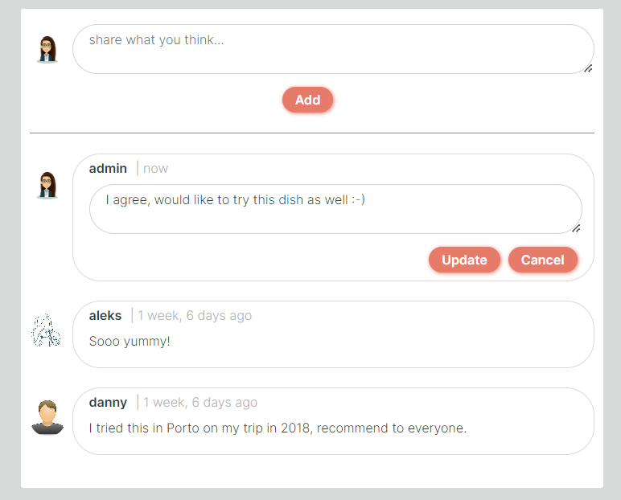

### Likes
- Allow user to express their interest in the post
- Like icons is marked green if user likes the post
- User cannot like their own posts
- Allow user to narrow their search to liked posts only when clicked on the ‘Feed’ option in the small menu
- User stories covered: 11

See feature screenshots

### Profile page
- Contains information about the user
- Displays info how many posts and followers user has and how many users they are following
- Displays profile information if it was provided by the profile owner
- Contains a dropdown menu to edit the profile and change profile password
- User stories covered: 25, 26, 27, 29, 30

See feature screenshot

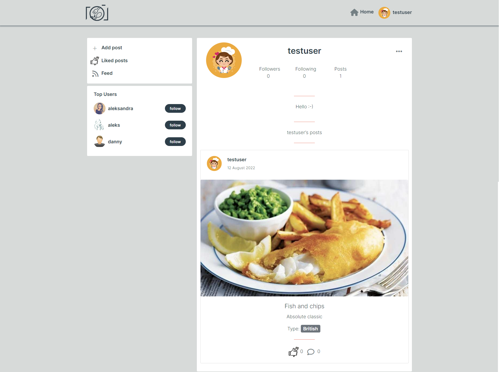

### Profile avatar
- Allow users to change their default avatar to their own avatar or picture
- Displayed in the navbar, at top of the post, within profile page and by user comment
- Displayed within ’Top Users’ menu
- User stories covered: 25, 26

See feature screenshot

### Password change form
- Allows user to change their profile password
- Contains password criteria visible on hover/tap of ‘view password criteria’ button
- User stories covered: 28

See feature screenshots

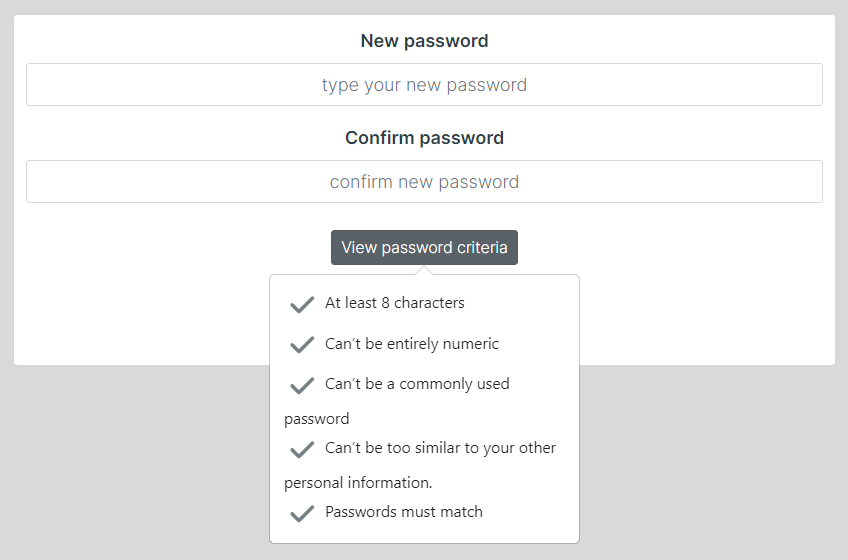

### Infinitive scroll
- Allows user to scroll through the content without having to select the next/previous page
- Used for the posts and comments
- Improves general user experience and user engagement
- Displays the loading spinner before loading
- User stories covered: 20

See feature screenshots

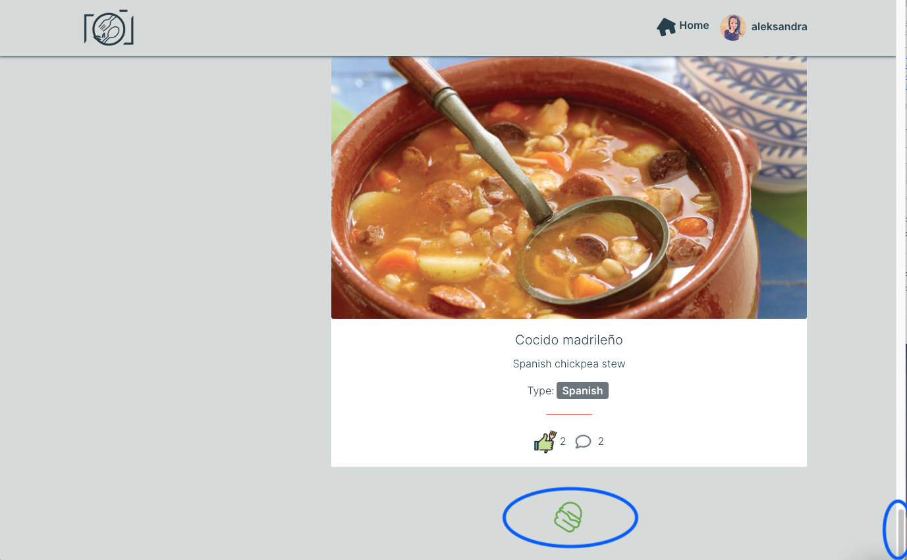

### Follow/unfollow
- Users are able to follow a specific profile they like and then be able to easily view their posts in the Feed
- User stories covered: 31

See feature screenshot

### ‘Add, liked, feed’ menu
- Allow user to create a post
- Featured on every page (except for the create/update post/profile or change password)
- Allow user to view only posts they liked
- Allow user to view only posts created by users they follow
- User stories covered: 7, 21, 22

See feature screenshots

### Top Users menu
- Displays three most followed users in the app
- Contains follow buttons next to username which allow following these users
- Featured on the majority of pages (except for edit post/profile or change password)
- User stories covered: 32

See feature screenshots

### Category badges:
- Allow to tag the post by the type of the cuisine
- Allow other users to find content they are most interested in 
- User stories covered: 23

See feature screenshots

### Search bar
- By typing a phrase in the search bar users can find a specific post or a user they are looking for
- Allows to search through all post title, users or post category
- Allows search through liked posts only or posts by users followed
- User can click on the eraser icon to clear the search content instead of hitting the backspace button
- User stories covered: 24

See feature screenshots

### 404 error page
- Displays if the user enters a URL that does not exist
- Contains a button to redirect user to the main page (in addition to the one in the nabber)
- User stories covered: 34

See feature screenshot

### Feedback messages
- User is provided with feedback message about the action their performed such as edited/deleted comment, updated profile or password, deleted a post
- User stories covered: 35

See feature screenshot

## Future features / improvements

Example of potential improvements to this project:

- Authentication
  - Allow user sign up to the app using email or require email input for registration
  - Forgotten password option to recover access to the account via email
  - Allow user authentication with already existing accounts, e.g. LinkedIn, Google, etc. 
- Profile
  - Option to send a message to other user
- Posts
  - Additional field to include the recipe of the dish
  - Show most liked posts in the app - similar to ‘Top Users’ menu
- Comments
  - Option to reply to a selected comment and create a conversation
  - Option to like/unlike other users’ comments

I was initially planning to have the functionality to delete user account but I decided to keep all the signed-up users within the database and do not allow them to remove their profile.

##### Back to [top](#table-of-contents)

## Validation 

### HTML
The W3C Markup Validation Service was used to validate the HTML of the website. No errors were identified. 

HTML
 
 

 

### CSS

The W3C Jigsaw CSS Validation Service was used to validate the CSS of the website. The app passes the validation with no errors. 

CSS
 
 

 

### JSX
The JSX code was validated using the ESLint utility and it passes without any significant issues affecting functionality of the application.

### Chrome Dev Tools Lighthouse 

Lighthouse was used to test the performance, accessibility, best practice and SEO of the site. The validation was done for both desktop & mobile.  

#### Desktop 

Landing page
 
 

 

Main posts page
 
 

 

#### Mobile 

Landing page
 
 

 

Main posts page
 
 

 

##### Back to [top](#table-of-contents)

## Testing
 
### Manual testing of user stories

1. As a user, I can see the home page with explanation of the portal, so that I know what the app is about

**Step** | **Expected Result** | **Actual Result**
------------ | ------------ | ------------ |
Navigate to https://ci-pp5-snapfood.herokuapp.com/ | Landing page loads with application description | Works as expected |
 

Screenshot

2. As a user, I can see a navbar on every page, so that I can easily return to main page and access my profile page

**Step** | **Expected Result** | **Actual Result**
------------ | ------------ | ------------ |
Load any page of the application| Navbar with different links is displayed on top of each page | Works as expected |
 

Screenshots

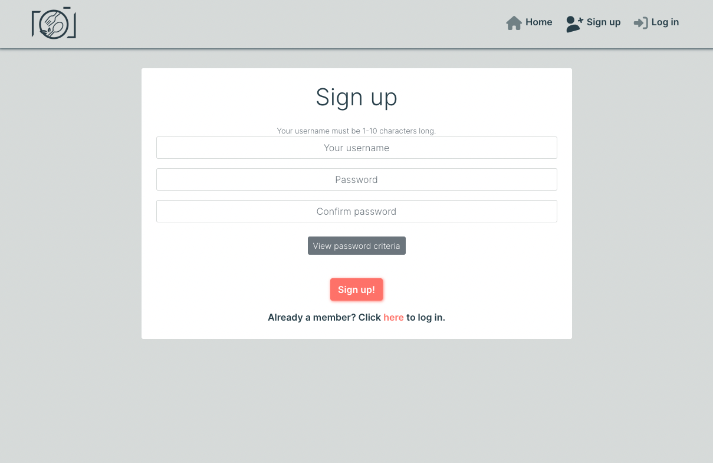

3. As a logged-out user, I can see log in and sign up options so that I can log in or sign up

**Step** | **Expected Result** | **Actual Result**
------------ | ------------ | ------------ |
Navigate to the main page and ensure you are logged out. If logged in, click on the profile avatar in the navbar and select ‘logout’ from the dropdown menu | Redirects to the landing page and displays options to log in or sign up | Works as expected |
 

Screenshot

4. As a new user, I can create a new account so that I can access the app

**Step** | **Expected Result** | **Actual Result**
------------ | ------------ | ------------ |
Navigate to https://ci-pp5-snapfood.herokuapp.com/, click ‘sign up’ icon in the navbar or ‘Happy to join!’ button. Type username, password and confirm the password | Redirects user to login page and on successful login with created credentials the user is logged in and this is indicated by display of their username and default avatar in the navbar | Works as expected |
 

Screenshots

5. As a returning user, I can log in with my existing credentials so that I can access the app

**Step** | **Expected Result** | **Actual Result**
------------ | ------------ | ------------ |
If logged out, on the landing page click on the ‘log in’ icon in the navbar or ‘I’m already a member, log me in!’ button. Type your existing username and password | Logs user in and displays the main posts page. Displays username and default avatar/profile picture in the navbar | Works as expected |
 

Screenshots

6.	As a user, I can maintain my logged-in status until I choose to log out so that my use of app is not compromised

**Step** | **Expected Result** | **Actual Result**
------------ | ------------ | ------------ |
Log in to the application and do not log out within the 24 hours | Users stay logged in for 24 hours unless choosing to log out themselves | Works as expected |
 

7. As a user, I can create posts so that I can share my food images with the community

**Step** | **Expected Result** | **Actual Result**
------------ | ------------ | ------------ |
Click on the ‘Add post’ in the left-hand side small menu and the posts create page will be shown | Add the post title, select the category and upload image (post description is optional) and click ‘create’ button. The post will appear in the main posts page | Works as expected |
 

Screenshots

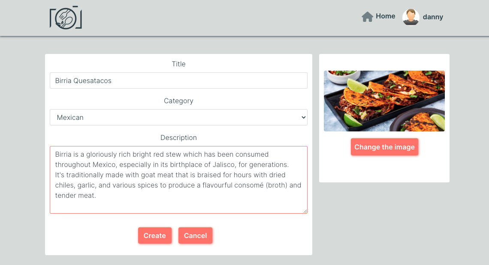

8.	As a user, I can categorise my post so that other users can find it by its tag

**Step** | **Expected Result** | **Actual Result**
------------ | ------------ | ------------ |
Click on the ‘Add post’ in the left-hand side small menu and the posts create page will be shown. Add posts details and select a category of the post (mandatory field) | Post is added and a category badge (type of cuisine) is displayed within the post under its title and description | Works as expected |
 

Screenshots

9. As a user, I can view other people’s posts so that I can get inspired by their images 

**Step** | **Expected Result** | **Actual Result**
------------ | ------------ | ------------ |
As a logged in user navigate to the main page by clicking on the 'Home' icon in the navbar | All posts will be displayed on the page | Works as expected |

Screenshot

10. As a user, I can view the details of a single post so that I can see its full description and other users’ comments

**Step** | **Expected Result** | **Actual Result**
------------ | ------------ | ------------ |
On the main post page click on the post image | Redirects to a specific post page and displays post details | Works as expected |

Screenshots

11. As user, I can like a specific post so that I can show my interest

**Step** | **Expected Result** | **Actual Result**
------------ | ------------ | ------------ |
On the main page or within specific profile page, click on the like icon under the post | Post is liked and like icon is marked green. Post is added to liked post page (/liked) | Works as expected |

Screenshots

12. As a user, I can view the details of a single post so that I can read other users’ comments and know what they think about it

**Step** | **Expected Result** | **Actual Result**
------------ | ------------ | ------------ |
Click on the post image | Redirects to a chosen post page and displays post details with comments below | Works as expected |

Screenshots

13. As a user, I can view a category for the post so that I know what cuisine the food image relates to

**Step** | **Expected Result** | **Actual Result**
------------ | ------------ | ------------ |
(no specific step to follow) | Once the post has been created by the user, a category is displayed within each post | Works as expected |

Screenshot

14. As user, I can add comments to a post so that I can share my thoughts about the post with the community

**Step** | **Expected Result** | **Actual Result**
------------ | ------------ | ------------ |
Within the post page (click on the post image to navigate to) under the post write your comment in the comment box and click 'Add' | Adds a comment to the comments list and increments the number of likes by 1 | Works as expected |

Screenshot

15. As a user, I can see when the comments were created so that I know how old a comment is

**Step** | **Expected Result** | **Actual Result**
------------ | ------------ | ------------ |
Click on a post image to navigate to the post page  | All comments with the creation date are displayed under the post | Works as expected |

Screenshot

16. As an owner of a comment, I can edit my comment so that I can update my existing comment

**Step** | **Expected Result** | **Actual Result**
------------ | ------------ | ------------ |
In the post page, click on the dropdown icon on the right hand side of your comment and click edit icon | Opens the edit post box | Works as expected |
Update the comment and click 'Update' button | Updates the comment, displays updated date to 'now' and displays a feedback message to the user | Works as expected |

Note: editing of other users' comments is not possible

Screenshots

17. As an owner of a comment, I can delete my comment from the post

**Step** | **Expected Result** | **Actual Result**
------------ | ------------ | ------------ |
In the post page, click on the dropdown icon on the right hand side of your comment and click delete (bin) icon | Removes the comment from all comments, displays a feedback message to the user in place of the comment and decrements the number of likes by 1 once the message has disappeared after a delay | Works as expected |

Note: deleting other users' comments is not possible

Screenshots

18. As a post owner, I can edit my post title and description so that I can make corrections or update my post after it was created

**Step** | **Expected Result** | **Actual Result**
------------ | ------------ | ------------ |
Click on the post you have added and within the post page click on the dropdown menu and then edit post icon | Redirects to the edit post page | Works as expected |
In the edit post page update details of your post and click 'Save' button | Updates post details and redirects to the post page | Works as expected |

Note: editing of other users' post is not possible

Screenshots

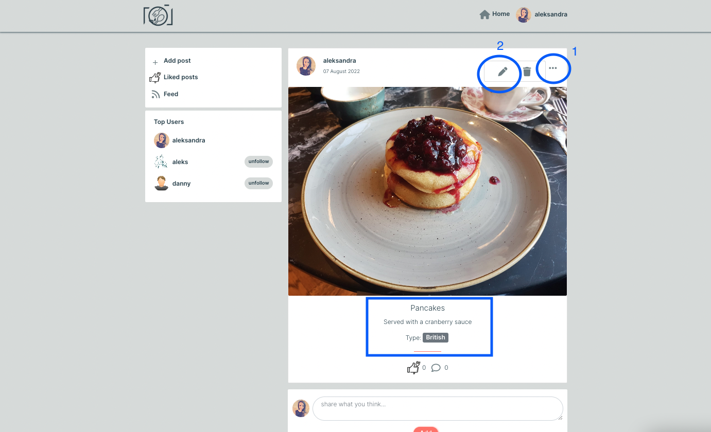

19. As a user, I can view posts ordered by most recently added so that I am up to date with the newest content

**Step** | **Expected Result** | **Actual Result**
------------ | ------------ | ------------ |
Add a new post and navigate to the main posts page | Adds post on top of the other posts and displays a date when it was added | Works as expected |

Screenshot

20. As a user, I can keep scrolling through the posts so that they are loaded automatically and I don't have to select the next page

**Step** | **Expected Result** | **Actual Result**
------------ | ------------ | ------------ |
Navigate to the main posts page and scroll to the bottom of the page | Loads new content and moves the scroll bar. Displays a spinning icon before the posts have been loaded | Works as expected |

Screenshots

21. As a user, I can see the posts I liked so that I can find the posts I enjoy the most

**Step** | **Expected Result** | **Actual Result**
------------ | ------------ | ------------ |
On the main posts page click on the 'Liked posts' icon/text | Loads all liked posts | Works as expected |

Screenshots

22. As a user, I can view posts from users I followed, so I can follow their activity

**Step** | **Expected Result** | **Actual Result**
------------ | ------------ | ------------ |
On the main posts page click on the 'Feed' icon/text | Loads all posts from followed users | Works as expected |

Screenshots

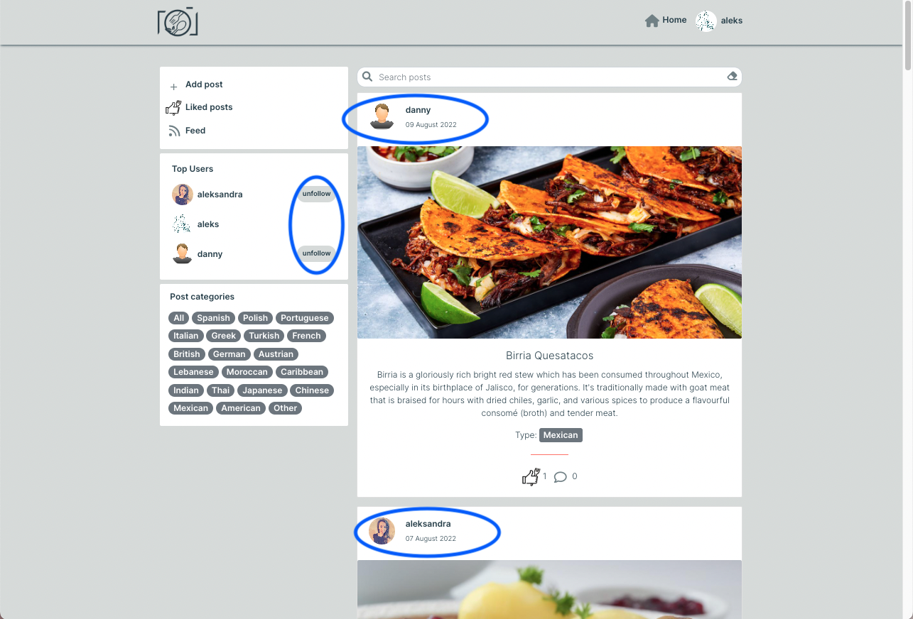

23. As a user, I can view posts category tags, so that I choose posts to display that I’m particularly interested in

**Step** | **Expected Result** | **Actual Result**
------------ | ------------ | ------------ |
On the main posts page click on the category badge of posts you'd like to view | Loads all posts with the selected category | Works as expected |

Screenshots

24. As a user, I can search for posts with keywords so that I can find the posts I am interested in

**Step** | **Expected Result** | **Actual Result**
------------ | ------------ | ------------ |
On the main posts page click on the search bar and type a phrase | Searches through all posts, users and post categories and displays posts containing searched words in their title, username or category | Works as expected |

Screenshots

25. As a user, I can add my profile avatar so that other users can easily identify me

**Step** | **Expected Result** | **Actual Result**
------------ | ------------ | ------------ |
Each user has a default avatar upon signing up to the app. Click on the profile avatar/user name in the navbar and select the 'Profile' from the dropdown | Redirects to the profile page | Works as expected |
Click on the dropdown menu and 'edit' icon | Redirects to the edit profile page | Works as expected |
Upload a profile avatar and click 'Save' | Saves user profile, displays a feedback message to the user, redirects to user profile page and displays updated user avatar and info | Works as expected |

Screenshots

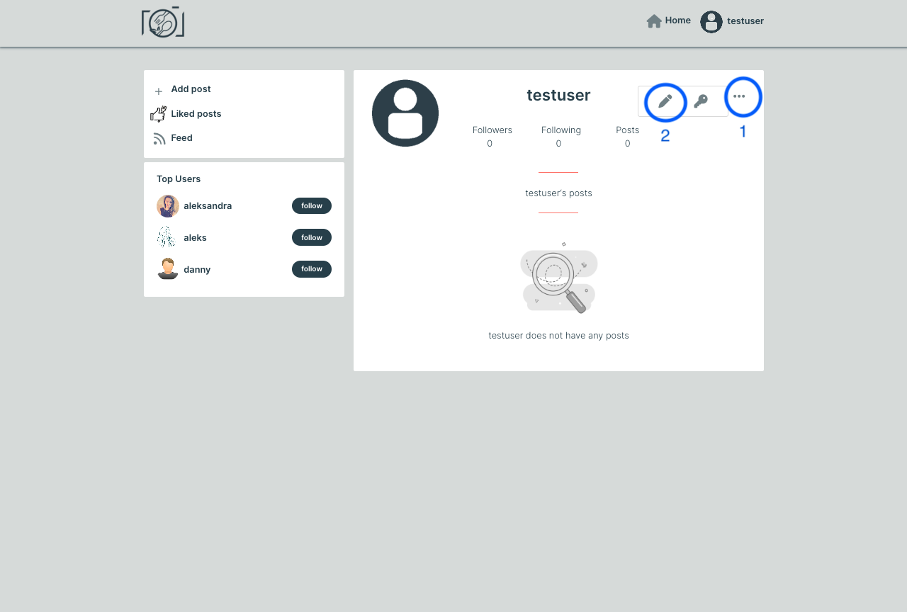

26. As a user, I can view user's avatars so that I can easily identify other users of the app

**Step** | **Expected Result** | **Actual Result**
------------ | ------------ | ------------ |
Navigate to the main page or specific post page | User avatars are displayed next to username in top users, by each post or user comment | Works as expected |

Screenshots

27. As a user, I can update the picture and description of my profile on the profile page so that other users view up to date info about me

**Step** | **Expected Result** | **Actual Result**
------------ | ------------ | ------------ |
Navigate to the user profile page and click on the dropdown menu and 'edit' icon | Redirects to the profile page | Works as expected |
Add profile description and click 'Save' button | Saves user profile information, displays a feedback message to the user, redirects to user profile page and displays updated user info | Works as expected |

Screenshots

28. As a user, I can change password to my account so that I can keep my profile secure

**Step** | **Expected Result** | **Actual Result**
------------ | ------------ | ------------ |
Navigate to the user profile page and click on the dropdown menu and the key icon | Redirects to the password change page | Works as expected |
Input password in the 'new password' and 'confirm password' fields | Displays warning massage if password criteria are not met. Otherwise, saves a new password, displays a feedback message and redirects user to the profile page after a short delay | Works as expected |

Screenshots

29. As a user, I can view all the posts by a specific user so that I can see their latest activity

**Step** | **Expected Result** | **Actual Result**
------------ | ------------ | ------------ |
Click on the user avatar or name | Redirects to the chosen user profile page and displays all their posts within the profile page | Works as expected |

Screenshots

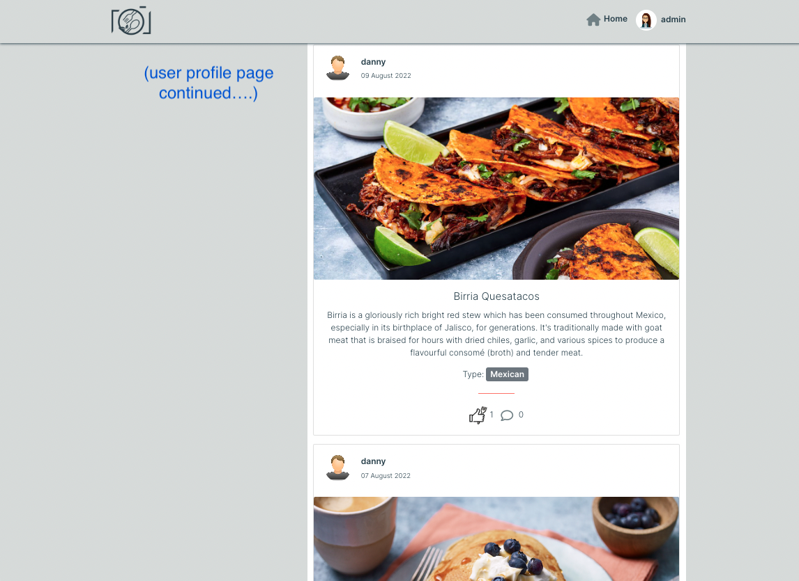

30. As a user, I can view other users’ profiles with their profile description, number of posts, followers and users followed so that I can learn more about them

**Step** | **Expected Result** | **Actual Result**
------------ | ------------ | ------------ |
Click on the user avatar or name | Redirects to the chosen user profile page and displays user avatar, number of followers, number of users followed, number of posts, user profile description (if added by the user) and user posts | Works as expected |

Screenshots

31. As a user, I can follow and unfollow other users so that I can get specific users’ posts in my posts feed

**Step** | **Expected Result** | **Actual Result**
------------ | ------------ | ------------ |
Click on the 'follow' button within the user profile page or by the username in 'Top Users' menu | Follows the user, increases the 'following' number on current profile and increases the number of followers on followed user's profile | Works as expected |

Screenshots

32. As a user, I can see a list of the most followed profiles so that I can see which profiles are popular

**Step** | **Expected Result** | **Actual Result**
------------ | ------------ | ------------ |
(no specific step to follow) | The small navigation menu with top most followed profiles is displayed on the main page, specific post page and profile page | Works as expected |

Screenshots

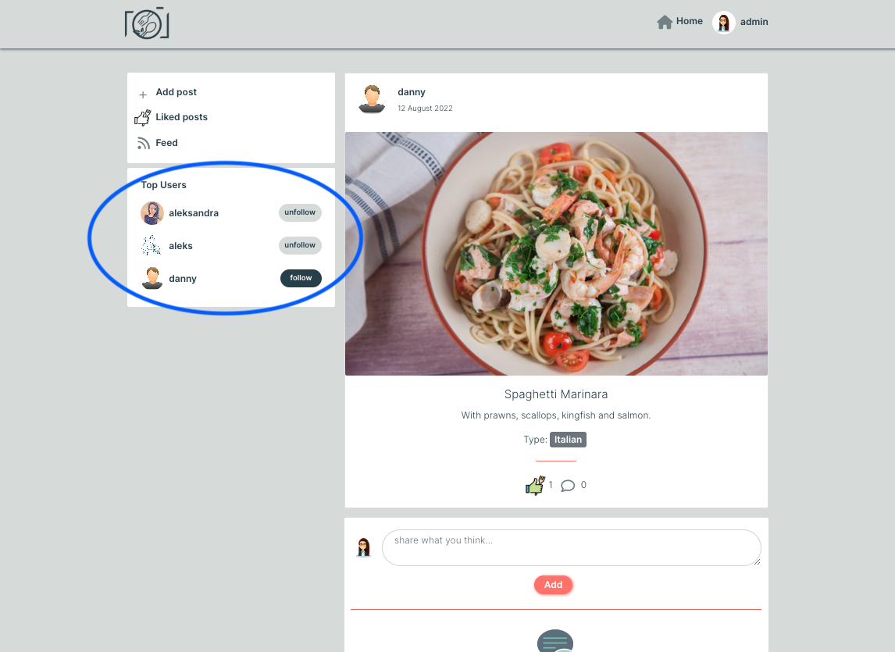

33. As a site owner I want my site to be fully responsive so that users can you use it on different devices

**Step** | **Expected Result** | **Actual Result**
------------ | ------------ | ------------ |
Change device screen size using chrome dev tools | The web functionality remains the same on various screen sizes | Works as expected |

Screenshots

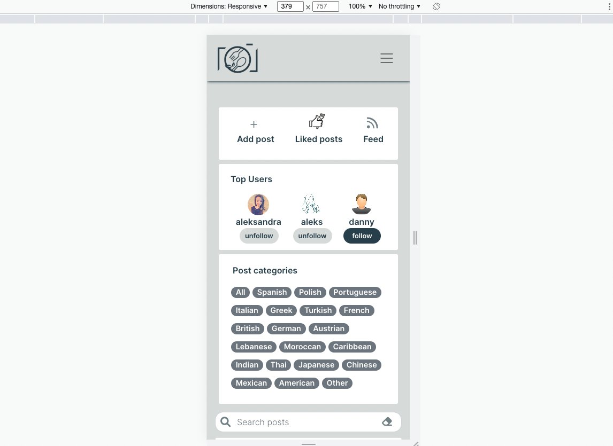

34. As a site owner, I want users to come to a 404 error page so that they don't have to user the browser back button if they enter a URL that does not exist

**Step** | **Expected Result** | **Actual Result**
------------ | ------------ | ------------ |
Type the wrong page in the www address (e.g. https://ci-pp5-snapfood.herokuapp.com/xyz) | Reroutes to a customised 404 page | Works as expected |

Screenshot

35. As a site user, I can view feedback messages, so that I know if my comment/profile/post has been updated

**Step** | **Expected Result** | **Actual Result**
------------ | ------------ | ------------ |
In the post page comments section click on the dropdown menu and 'edit' icon to edit your existing comment. Make changes to your comment and click 'Update' | Saves the comment, changes time display to 'now' and displays the feedback message to the user | Works as expected |
In the post page comments section click on the dropdown menu and 'bin' icon to delete your existing comment | Deletes the comment and displays the feedback message in its place | Works as expected |
In the profile page click on the dropdown menu and 'edit' icon to edit user profile. Make desired changes and click 'Save' | Updates the profile, displays the feedback message and redirects the user to their profile page after a short delay | Works as expected |
In the profile page click on the dropdown menu and the key icon to change user password. Update the password and click 'Save' | Updates the password, displays the feedback message and redirects the user to their profile page after a short delay | Works as expected |
Within the post page click on the dropdown menu and 'bin' icon to delete the post | Deletes the post, displays the feedback message and redirects the user to the main posts page | Works as expected |

Screenshots

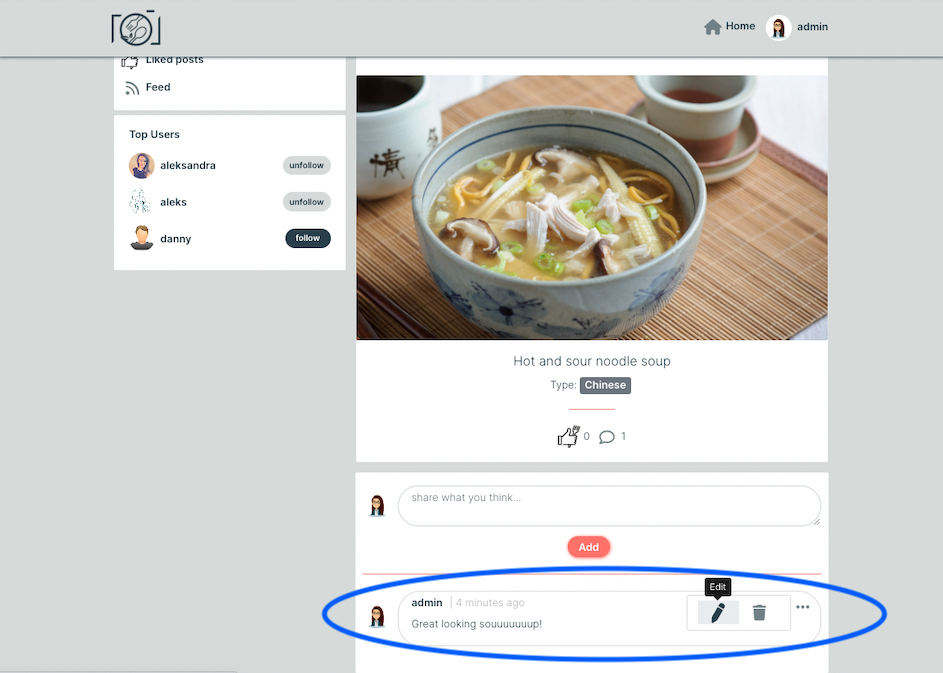

### Performing tests on various devices

The website was tested using Google Chrome Developer Tools Toggle Device Toolbar to simulate viewports of different devices.

The website was tested on the following devices:
- ASUS ZenBook (laptop screen)
- Samsung Galaxy Tab A (tablet screen)
- Samsung S7 (mobile screen)

### Browser compatibility

Testing has been carried out on the following browsers:
- Googe Chrome Version Version 104.0.5112.79 (Official Build) (64-bit)
- Firefox Browser version 103.0.2 (64-bit)
- Version 104.0.1293.54 (Official build) (64-bit)

##### Back to [top](#table-of-contents)

## Deployment

##### Back to [top](#table-of-contents)

## Credits

### Images

- 404 picture tweaked using Paint taken from [here](https://www.istockphoto.com/pl/wektor/broken-danie-gm1132925979-300527202)
- No results found picture taken from [here](https://www.vecteezy.com/vector-art/7104553-search-no-result-not-found-concept-illustration-flat-design-vector-eps10-modern-graphic-element-for-landing-page-empty-state-ui-infographic-icon)
- Speech bubble image on comments page with no comments was taken from [here](https://www.freepik.com/free-vector/illustration-speech-bubble_2606145.htm#query=chat&position=17&from_view=search)
- The lading page image of hands holding smartphone and taking photo of food comes from [here](https://media.istockphoto.com/vectors/hands-holding-smartphone-and-capture-photo-of-healthy-food-in-modern-vector-id1263096919?k=20&m=1263096919&s=612x612&w=0&h=YQ70hwbYb1LcCl16TvpzVv03lIVfiQ848fLhFCvW4BY=)
- The thumb-up icon for like/unlike was taken from [here](https://image.shutterstock.com/shutterstock/photos/1391842757/display_1500/stock-vector-vector-hand-like-icon-template-good-food-logo-illustration-with-fork-sign-line-symbol-for-farmers-1391842757.jpg) and tweaked using Paint
- Site logo was created with [Fiverr Logo Maker](https://www.fiverr.com/logo-maker/brief/logo_name?brief_id=0d212c49-2416-401d-99a5-780b9b233ff7)
- Upload image icon taken from [here](https://static.thenounproject.com/png/741679-200.png) combining [this](https://cdn-icons-png.flaticon.com/512/80/80320.png) image using Paint
- Admin user avatar found [here](https://us.123rf.com/450wm/yupiramos/yupiramos1704/yupiramos170412377/75993207-businesswoman-avatar-character-icon-vector-illustration-design.jpg?ver=6)
- A majority of food photographs added as posts were found via Google Search Engine or added directly by each user testing the app. Due to extensive testing of this app, I'm not able to provide the sources of all of the pictures found via search engine. As this application was created for the education purpose only, please do not repost the images without crediting the source.

### Code

### Acknowledgements
